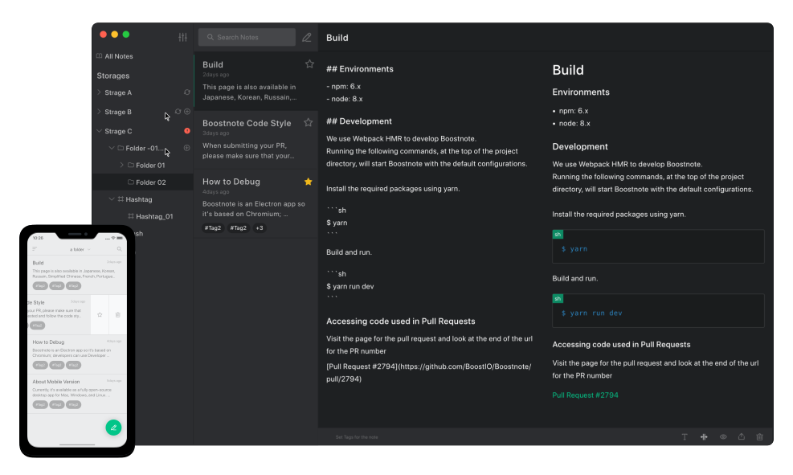

<div align="center">
  
  
  [https://boostnote.io/](https://boostnote.io/)
</div>



<h2 align='center'>A Polished Notes App with Github Flavored Markdown</h2>
<h3 align="center">for macOS, Windows and Linux</h5>

Boost Note is a renewal of [Boostnote app](https://github.com/BoostIO/Boostnote).

It will be officially released in January 2020.

## Roadmap

- Browser app
- Desktop app(Windows, mac and Linux)
- Mobile app(Android and iOS)
- Cloud storage
- File attachments(Image, Video and any kind of files)
- MDX (TBA)

## Authors & Maintainers

- [Rokt33r](https://github.com/rokt33r)
- [ZeroX-DG](https://github.com/ZeroX-DG)
- [Flexo](https://github.com/Flexo013)


## Community

- [Facebook Group](https://www.facebook.com/groups/boostnote/)
- [Twitter](https://twitter.com/boostnoteapp)
- [Slack Group](https://join.slack.com/t/boostnote-group/shared_invite/enQtMzkxOTk4ODkyNzc0LWQxZTQwNjBlMDI4YjkyYjg2MTRiZGJhNzA1YjQ5ODA5M2M0M2NlMjI5YjhiYWQzNzgzYmU0MDMwOTlmZmZmMGE)
- [Blog](https://medium.com/boostnote)
- [Reddit](https://www.reddit.com/r/Boostnote/)

## Build

### Web app

```sh
# Install deps
npm i

# Compile script
npm run build

# Deploy to now.sh
now
```

### Electron app

```sh
# Install deps
npm i

# Compile script
npm run build

# Package app
npm run pack
```

## License

[GPL-3.0 © 2020 BoostIO](./LICENSE.md)
