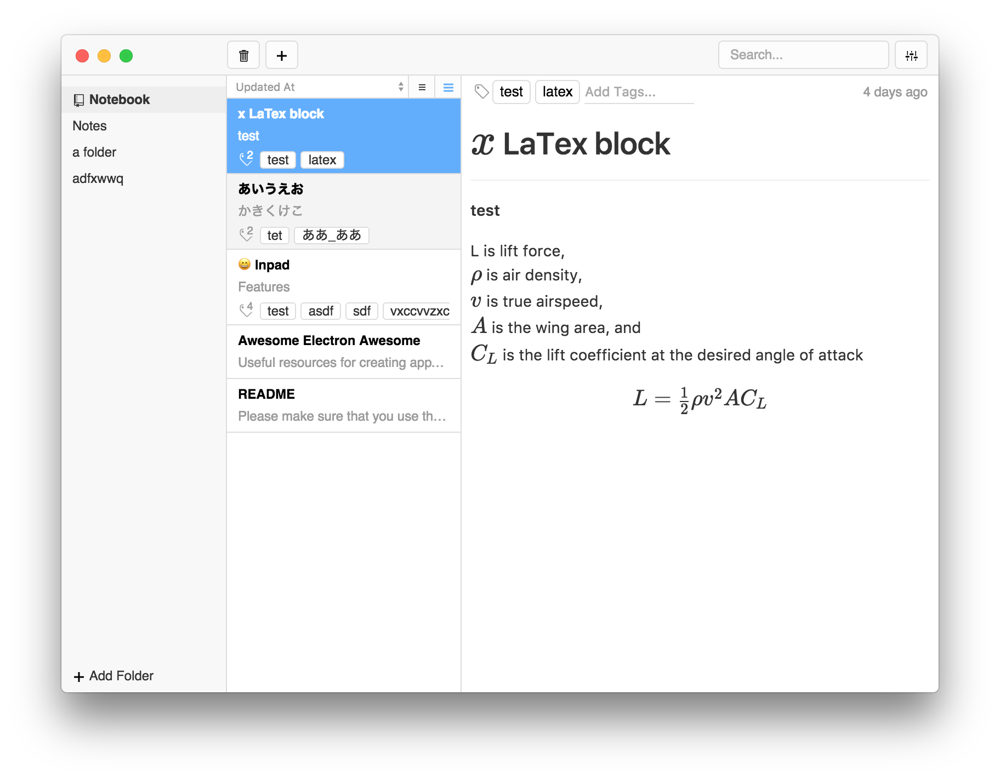

<h1 align='center'>
   
</h1>
<h2 align='center'>A Polished Notes App with Github Flavored Markdown</h2>
<h3 align="center">for macOS, Windows and Linux</h5>

# Inpad

🚧🚧🚧 This app is still UNDER CONSTRUCTION! 🚧🚧🚧

You can contact me directly by Gitter! 

## Features

- More organize option
- Github Flavored Markdown(with Latex)
- Using PouchDB(competible CouchDB and  any LevelDB adapter)

## Stack

- Electron
- React
- React Router
- Styled Components
- Redux
- Webpack
- PouchDB / LevelDB
- wooorm/Remark
- Katex
- Codemirror
- Octicon
- Github Markdown CSS

## Development

- [Build](./docs/development/build.md)
- [Coding Style](./docs/development/coding-style.md)
- [Modules](./docs/development/modules.md)
- [Database](./docs/development/database.md)
- [Redux Store](./docs/development/redux-store.md)
- [Config](./docs/development/config.md)
- [Ipc](./docs/development/ipc.md)
- [Keymap and Commands](./docs/development/keymap-and-commands.md)
- [Testing](./docs/development/testing.md)

## License

[MIT © 2016 Sarah Seo](./LICENSE.md)
