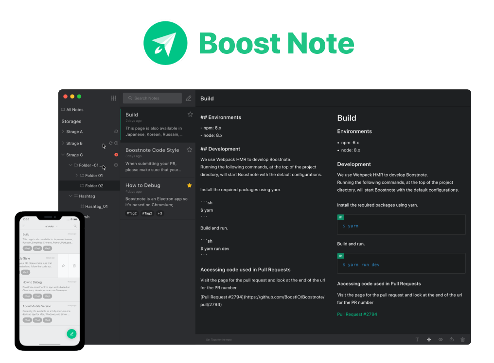

<h2 align='center'>A Polished Notes App with Github Flavored Markdown</h2>
<h3 align="center">for macOS, Windows and Linux</h5>

Boost Note will be renewal of Boostnote app.

The renewal will be released Jan, 2020. [To keep updated, subscribe our mailing list!](https://boostnote.io/#subscribe)

- [Renewal plan](https://github.com/BoostIO/Boostnote.next/issues/67)

## Roadmap

- Browser app
- Desktop app(Windows, mac and Linux)
- Mobile app(Android and iOS)
- Cloud storage
- File attachments(Image, Video and any kind of files)
- MDX (TBA)

## Build

### Web app

```sh
# Install deps
npm i

# Compile script
npm run build

# Deploy to now.sh
now
```

### Electron app

```sh
# Install deps
npm i

# Compile script
npm run build

# Package app
npm run pack
```

## License

[GPL-3.0 © 2019 BoostIO](./LICENSE.md)
