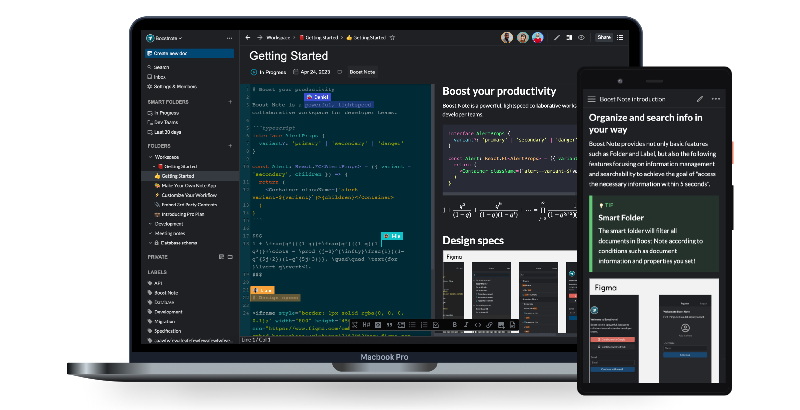

<div align="center">
  

[https://boostnote.io/](https://boostnote.io/)

</div>



<h2 align='center'>Collaborate easily, in real-time.</h2>

Boost Note is a collaborative real-time markdown note app
for developer teams.

## 👷 Core Team (maintainers)

- [Rokt33r](https://github.com/rokt33r)
- [ButteryCrumpet](https://github.com/ButteryCrumpet)
- [Davy-c](https://github.com/Davy-c)
- [Komediruzecki](https://github.com/Komediruzecki)

## 📦 Download App

### 🖥 Desktop

- [🌎 Web App (boostnote.io)](https://boostnote.io)
- [🍎 macOS (.dmg)](https://github.com/BoostIO/BoostNote-App/releases/latest/download/boost-note-mac.dmg)
- [:framed_picture: Windows (.exe NSIS)](https://github.com/BoostIO/BoostNote-App/releases/latest/download/boost-note-win.exe)
- [🐧 Linux (.deb)](https://github.com/BoostIO/BoostNote-App/releases/latest/download/boost-note-linux.deb)
- [🐧 Linux (.rpm)](https://github.com/BoostIO/BoostNote-App/releases/latest/download/boost-note-linux.rpm)

### 📱 Mobile

- [🌎 Mobile Web App (m.boostnote.io)](https://m.boostnote.io)
- [🍏 iOS (Apple App Store)](https://apps.apple.com/gb/app/boost-note-mobile/id1576176505)
- [🤖 Android (Google Play Store)](https://play.google.com/store/apps/details?id=com.boostio.boostnote2021)

## 💥 Have some troubles?

If you don't know how to use the app, please create a discussion on [our Q&A discussion page](https://github.com/BoostIO/BoostNote-App/discussions/categories/general).

If you find a bug, please create an issue to [our GitHub issue tracker](https://github.com/BoostIO/BoostNote-App/issues).

If it is urgent or private, please join [our Slack channel](https://join.slack.com/t/boostnote-group/shared_invite/zt-cun7pas3-WwkaezxHBB1lCbUHrwQLXw) and send a direct message to @rokt33r.

## 🤲 Wanna contribute?

If you're interested in our project, you can participate in many different ways.

- Sharing your idea
- Helping community
- Resolving existing issues

Read our [contributing guide](CONTRIBUTING.md), to learn about our development process, how to propose bugfixes and improvements.

### Sharing your idea

To improve the app, we need your idea! It could be a new feature or an improvement for existing features. If you have any, please create a discussion in [Feature Requests category](https://github.com/BoostIO/BoostNote-App/discussions/categories/feature-requests).

### Helping community

There are many ways to help our community. You can share how you're using our app by writing an article. You can write it in [General discussion page](https://github.com/BoostIO/BoostNote-App/discussions/categories/general), external developer community (Dev.to or Reddit) and your blog if you have one.

Also, you can help other users by answering their questions in [here](https://github.com/BoostIO/BoostNote-App/discussions/categories/q-a).

### Resolving existing issues

We have left the "help wanted" label to [some issues](https://github.com/BoostIO/BoostNote-App/issues?q=is%3Aissue+is%3Aopen+label%3A%22help+wanted+%3Asos%3A%22) which external contributors could try to resolve. Some of them might have a small bounty so you can get a cup of coffee from it after hacking. If you find any interesting issues but their specs are not clear or you don't know how to fix them, please leave a comment on the issues. Then, we will give you more instructions.

## Development

Currently, we provide the frontend source code only so you cannot host our backend server by yourself.
But you can participate in development via mock backend mode. Although it still doesn't cover every API yet, you can access the basic folder and document management.

### How to run the app

Create .env file.

```sh
MOCK_BACKEND=true
BOOST_HUB_BASE_URL=http://localhost:3004
```

Run webpack processors. You have to run them in separate terminals.

```sh
npm run dev:cloud
# You can skip next two scripts if you don't need to run electron app.
npm run dev:electron
npm run dev:webpack
```

### How to extend mock backend

When the mode is enabled, all API calls will be passed to `src/cloud/api/mock/mockHandler.ts`.

The source code is quite similar to a router interface. All you need to is `method`, `pathname` and a handler function. So, when you confront `Not Found` error while calling `GET /api/something`, you can simply add a mock route like below.

```ts
{
  method: 'get',
  pathname: 'api/something',
  handler: ({ search }): GetSomethingResponse => {
    return {
      ...something
    }
  },
}
```

### Scripts

- Development scipts
  - `npm run dev:cloud` : Run webpack for the cloud space
  - `npm run dev:webpack` : Run webpack for the desktop app main window renderer
  - `npm run dev:electron` : Run webpack for the desktop app main processor
  - `npm run dev:mobile` : Run webpack for the mobile app
  - `npm run lint` : Check lint errors
  - `npm run format` : Try to fix lint errors automatically
  - `npm test` : Run test script
  - `npm run tsc` : Check type errors
- Build scripts
  - `npm run build:electron` : Build assets for the desktop app
  - `npm run build:cloud` : Build asssets for the cloud space
  - `npm run build:mobile` : Build assets for the mobile app
  - `npm start` : Run the desktop app with prebuilt assets
  - `npm run meta` : Prepare meta data for the desktop app building(Generate package.json for electron-build module)
  - `npm run prepack` : Create desktop app installers without signing
  - `npm run release` : Create desktop app installers for production and upload them to GitHub

## 🔗 Links

- [Twitter](https://twitter.com/boostnoteapp)
- [Slack Group](https://join.slack.com/t/boostnote-group/shared_invite/zt-cun7pas3-WwkaezxHBB1lCbUHrwQLXw)
- [Blog](https://medium.com/boostnote)
- [Reddit](https://www.reddit.com/r/Boostnote/)
- [BoostNote-Legacy](https://github.com/BoostIO/BoostNote)
- [BoostNote.next-local](https://github.com/BoostIO/BoostNote.next-local)

## ⚖️ License

[GPL-3.0 © 2016 - 2021 BoostIO](./LICENSE.md)
